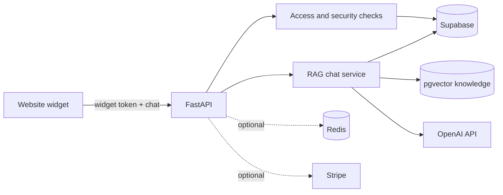

# MBD API — Multilingual RAG Chatbot

MBD API is a production-style backend for adding a multilingual, knowledge-grounded chatbot to a website.

It solves a common problem: users want direct answers, but an organization's useful information is spread across menus, product catalogs, policies, FAQs, and other documents. A general chatbot may answer fluently while inventing details. This project uses retrieval-augmented generation (RAG) to find relevant source material first, then asks an LLM to answer from that context.

The architecture can support many knowledge-based assistants. The included reference implementation uses restaurants as its tenant model and ships with a fictional **Cedar & Salt** dataset.

## What it provides

- Multilingual chat in Mandarin, English, French, Hindi, Japanese, Korean, and Spanish
- Tenant-isolated vector search with Supabase PostgreSQL and pgvector
- Streaming NDJSON responses for a responsive web widget
- Persistent sessions and follow-up context
- Repeatable, transactional knowledge ingestion
- Origin-bound widget tokens and per-tenant access controls
- Optional Redis caching and distributed rate limiting
- Optional Stripe webhook processing
- A Docker image, Render Blueprint, and GitHub Actions checks

## Architecture



A typical chat request follows this path:

1. Validate the body, origin, tenant, subscription, rate limit, and widget token.
2. Restore or create the multilingual chat session.
3. Embed the question and retrieve tenant-scoped knowledge from pgvector.
4. Generate an answer using only the retrieved context.
5. Stream text and optional image events to the widget.
6. Persist the updated session and message metadata.

Important modules:

| Path | Responsibility |
| --- | --- |
| `mbd_api/app.py` | FastAPI application, middleware, and routes |
| `mbd_api/service.py` | Chat workflow and access enforcement |
| `mbd_api/rag.py` | Retrieval and response orchestration |
| `mbd_api/security.py` | Widget-token and session security |
| `mbd_api/caching.py` | In-memory and optional Redis controls |
| `mbd_api/repository.py` | Supabase PostgREST and RPC client |
| `mbd_api/ingest.py` | Repeatable knowledge-ingestion CLI |
| `supabase/migrations/` | Fresh database schema and RLS policies |
| `demo/cedar-and-salt/` | Example manifest and original demo imagery |

`rag-chatbot.py`, `supabase_store.py`, and `stripe_billing.py` remain as compatibility entrypoints.

## Security decisions

- Widget tokens are signed with HS256 and bound to a tenant, browser origin, and short expiry.
- Tenant subscription, origin, token, session, and vector filters are checked on every chat request.
- Supabase uses row-level security. Runtime tables and ingestion RPCs are available only to the backend service role.
- The service-role key is never sent to the browser.
- Requests are limited to 64 KiB and messages to 4,000 characters by default.
- Rate limits apply per client IP and per session. Redis is optional; one Uvicorn worker uses an in-memory limiter by default.
- Forwarded IP headers are ignored unless proxy trust is explicitly enabled.
- Client errors are sanitized and include a request ID for log correlation.
- `/readyz` checks required Supabase access without calling OpenAI.
- Production startup rejects missing secrets, weak signing keys, invalid Stripe settings, and contradictory cache settings.

The demo subscription is seeded locally so access checks remain active. There is no demo bypass.

## Local quick start

### Prerequisites

- Python 3.12 or 3.13
- Docker
- Supabase CLI
- An OpenAI API key

### 1. Install the project

```bash
python3.12 -m venv .venv
source .venv/bin/activate
pip install -r requirements-dev.txt
test -f .env || cp .env.example .env
```

Add your OpenAI key to `.env`.

### 2. Start the local database

```bash
supabase start
supabase status
```

The first command applies the migration and `supabase/seed.sql`. Copy the reported API URL and service-role key into these `.env` values:

```dotenv
SUPABASE_URL=http://127.0.0.1:54321
SUPABASE_SERVICE_ROLE_KEY=<local-service-role-key>
```

### 3. Load the demo knowledge

Serve repository assets in one terminal:

```bash
python -m http.server 5173
```

Validate and ingest the Cedar & Salt manifest in another terminal:

```bash
python -m mbd_api.ingest \
  --manifest demo/cedar-and-salt/restaurant.json \
  --asset-base-url http://localhost:5173/demo/cedar-and-salt \
  --dry-run

python -m mbd_api.ingest \
  --manifest demo/cedar-and-salt/restaurant.json \
  --asset-base-url http://localhost:5173/demo/cedar-and-salt \
  --prune
```

`--prune` is always explicit. Without it, ingestion never removes existing source rows.

### 4. Start the API and demo

```bash
make serve
```

Verify the service:

```bash
curl http://localhost:8000/healthz
curl -i http://localhost:8000/readyz
```

Open [http://localhost:5173/chat-ui-ref-files/](http://localhost:5173/chat-ui-ref-files/) to use the widget.

## Ingestion design

The supported interface is:

```text
python -m mbd_api.ingest --manifest <file> [--asset-base-url <url>] [--batch-size N] [--prune] [--dry-run]
```

Manifests use JSON schema version 1. Each chunk has a stable `source_key` and `external_id`, content, optional source metadata, and an optional image path or URL.

The pipeline:

- creates deterministic chunk IDs;
- compares content hashes and skips unchanged embeddings;
- batches `text-embedding-3-small` embeddings at 1,536 dimensions;
- uploads rows to a service-role-only staging table;
- validates and activates a complete run in one transaction;
- leaves active knowledge unchanged if staging or validation fails;
- prints a machine-readable JSON summary.

Relative image paths require `--asset-base-url` so stored URLs work outside the repository.

## API

| Method | Endpoint | Purpose |
| --- | --- | --- |
| `GET` | `/healthz` | Process health |
| `GET` | `/readyz` | Required dependency readiness |
| `POST` | `/api/widget-token` | Issue an origin- and tenant-bound widget token |
| `POST` | `/api/chat-stream` | Stream chat events as `application/x-ndjson` |
| `POST` | `/api/stripe/webhook` | Process subscription events when enabled |

The chat stream preserves these event types:

```text
session -> delta* -> images? -> done
                         \-> error
```

The public API currently uses `restaurantId` as the tenant identifier. A broader deployment can rename this domain concept while keeping the same access and RAG architecture.

## Configuration

See `.env.example` for every setting. Required runtime values are:

- `OPENAI_API_KEY`
- `SUPABASE_URL`
- `SUPABASE_SERVICE_ROLE_KEY`
- `WIDGET_SIGNING_KEYS`, such as `v1:<random-secret>`
- `WIDGET_ACTIVE_KID`, which must match a configured key

Optional infrastructure is disabled by default:

- `QUERY_CACHE_ENABLED=false`: Redis query caching is off.
- `RATE_LIMIT_REDIS_URL=`: the service uses its in-memory limiter.
- `STRIPE_WEBHOOKS_ENABLED=false`: the webhook returns a stable `503`; subscription checks still run.

For production, use a random signing secret of at least 32 characters, disable localhost origins, register the real website origin in Supabase, and enable proxy trust only behind a known proxy such as Render.

## Quality and deployment

```bash
make test        # unit and HTTP tests
make lint        # Ruff format and lint checks
make typecheck   # mypy
make audit       # dependency vulnerability audit
make docker-build
```

GitHub Actions runs tests on Python 3.12 and 3.13, applies the migration to an empty pgvector database, audits dependencies, scans for secrets, and verifies the production Docker build.

The Docker image runs as a non-root user with one Uvicorn worker. `render.yaml` contains a credential-free Render deployment definition; secrets are entered during deployment rather than stored in Git.
