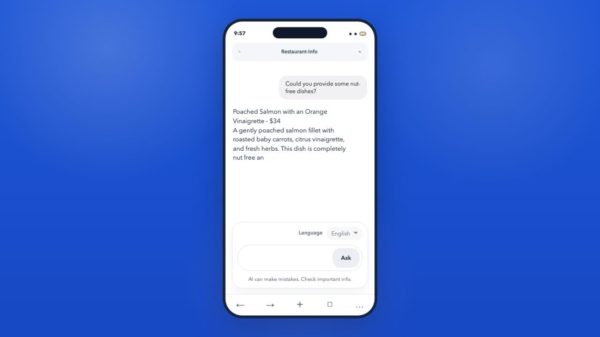
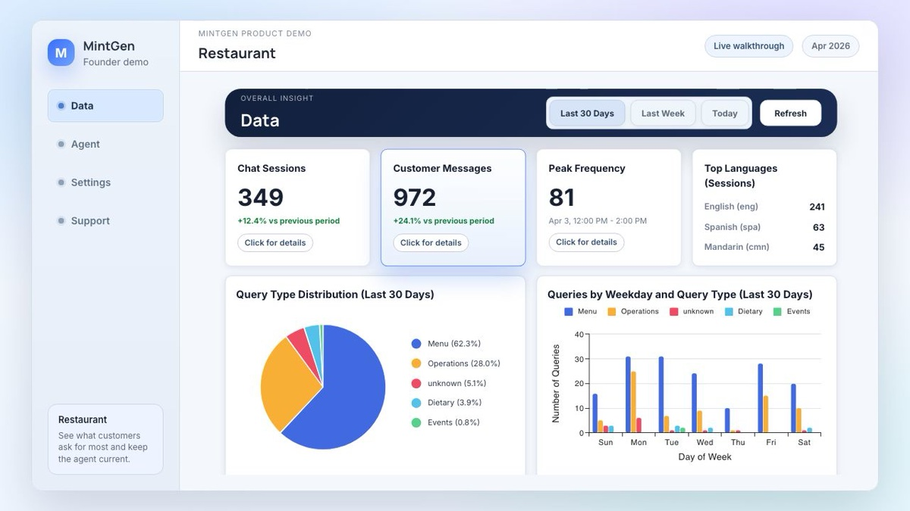
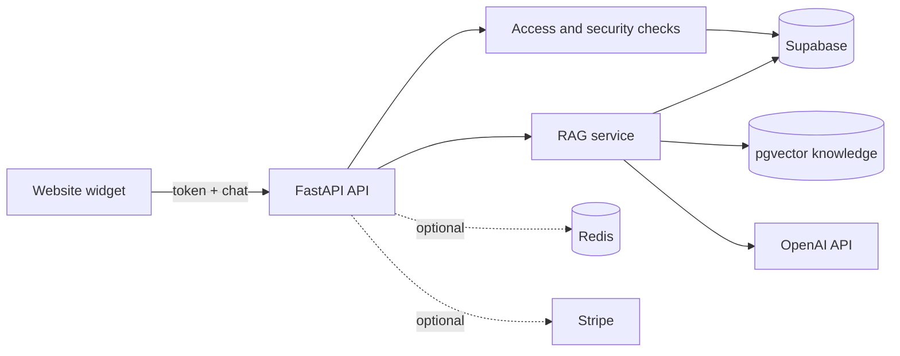

# MintGen — Multilingual RAG for Restaurants

MintGen is a multilingual, knowledge-grounded assistant that helps restaurant guests get useful answers without waiting for a staff member. It combines a customer-facing chat widget with a companion analytics dashboard.

## Why I built MintGen

When I visit an unfamiliar restaurant, I often have a few simple questions: What is popular? What should I order? Does this dish match what I like?

Those questions matter even more when I am eating with friends who have serious allergies. We may need to understand ingredients or preparation details before ordering, but the restaurant might be busy and a server may not be available for every quick question. Language differences can make that conversation harder still.

I built MintGen to make restaurant-provided information easier to access. A guest can ask a question in their preferred language and get an immediate answer grounded in the restaurant's own menu and operating information.

MintGen supports informed decisions; it does not replace restaurant staff. The assistant can surface recorded dietary and allergen information, but anyone with a severe allergy should always confirm directly with the restaurant before ordering.

## What I built

MintGen connects two experiences:

- **Guest assistant:** an embeddable chat widget for menu recommendations, ingredients, dietary options, hours, reservations, pickup, and other common questions.
- **Restaurant dashboard:** a companion product for reviewing usage, common questions, language patterns, and knowledge content.

The assistant uses retrieval-augmented generation (RAG). It first retrieves relevant restaurant knowledge, then asks the language model to answer from that context instead of relying on general knowledge alone.

## Product demos

### Guest-facing assistant

[](demo/media/agent-demo.mp4)

*A guest asks about nut-free dishes and continues the conversation in another language. Click the image to watch the one-minute demo.*

### Restaurant dashboard

[](demo/media/restaurant-dashboard-demo.mp4)

*A walkthrough of restaurant analytics, usage patterns, languages, and knowledge management. Click the image to watch the demo.*

> This repository contains the API and guest widget. The restaurant dashboard shown above is a companion product maintained in a separate repository.

## Beyond restaurants

The restaurant use case is one example of a broader problem: organizations have trusted information, but users cannot always find it or ask for it in their preferred language.

The same tenant-isolated RAG pattern can support product catalogs, customer-service documentation, venues, local services, or internal knowledge bases. The current API calls each tenant a `restaurant`, but the retrieval, security, ingestion, and multilingual layers are reusable across domains.

## Capabilities

- Mandarin, English, French, Hindi, Japanese, Korean, and Spanish conversations
- Tenant-isolated semantic search with Supabase PostgreSQL and pgvector
- Streaming NDJSON responses for a responsive web widget
- Persistent sessions and follow-up context
- Repeatable, transactional knowledge ingestion
- Origin-bound widget tokens and subscription checks
- Optional Redis caching and distributed rate limiting
- Optional Stripe webhook processing
- Docker, Render, and GitHub Actions support

## Architecture



Each chat request follows the same path:

1. Validate the body, origin, tenant, subscription, rate limit, and widget token.
2. Restore or create the multilingual chat session.
3. Embed the question and retrieve tenant-scoped knowledge from pgvector.
4. Generate an answer using only the retrieved context.
5. Stream text and optional image events to the widget.
6. Persist the session and message metadata.

Key modules:

| Path | Responsibility |
| --- | --- |
| `mbd_api/app.py` | FastAPI application, middleware, and routes |
| `mbd_api/service.py` | Chat workflow and access enforcement |
| `mbd_api/rag.py` | Retrieval and response orchestration |
| `mbd_api/security.py` | Widget-token and session security |
| `mbd_api/caching.py` | In-memory and optional Redis controls |
| `mbd_api/repository.py` | Supabase PostgREST and RPC client |
| `mbd_api/ingest.py` | Knowledge-ingestion CLI |
| `supabase/migrations/` | Database schema and RLS policies |
| `demo/cedar-and-salt/` | Fictional demo manifest and imagery |

`rag-chatbot.py`, `supabase_store.py`, and `stripe_billing.py` remain as compatibility entrypoints.

## Security decisions

- Widget tokens use HS256 and are bound to a tenant, browser origin, and short expiry.
- Subscription, origin, token, session, and vector filters are checked on every chat request.
- Supabase row-level security protects runtime data and service-role-only ingestion operations.
- The Supabase service-role key is never exposed to the browser.
- Requests are limited to 64 KiB and messages to 4,000 characters by default.
- Rate limits apply per client IP and session. Redis is optional; the default single-worker setup uses an in-memory limiter.
- Forwarded IP headers are trusted only when explicitly enabled behind a known proxy.
- Client errors are sanitized and include a request ID for log correlation.
- `/readyz` checks Supabase without calling OpenAI.
- Production startup rejects missing or weak secrets and contradictory optional-service settings.

The local seed keeps subscription checks active. There is no demo bypass.

## Transactional ingestion

The supported ingestion interface is:

```text
python -m mbd_api.ingest --manifest <file> [--asset-base-url <url>] [--batch-size N] [--prune] [--dry-run]
```

Version 1 JSON manifests give every chunk a stable `source_key` and `external_id`. The pipeline:

- creates deterministic chunk IDs;
- compares content hashes and skips unchanged embeddings;
- batches `text-embedding-3-small` embeddings at 1,536 dimensions;
- writes to a service-role-only staging table;
- validates and activates a complete run in one transaction;
- leaves active knowledge unchanged if staging or validation fails;
- removes stale rows only when `--prune` is explicit;
- prints a machine-readable JSON summary.

Relative image paths require `--asset-base-url` so the stored URLs remain valid outside the repository.

## Local quick start

### Prerequisites

- Python 3.12 or 3.13
- Docker
- Supabase CLI
- An OpenAI API key

### 1. Install the project

```bash
python3.12 -m venv .venv
source .venv/bin/activate
pip install -r requirements-dev.txt
test -f .env || cp .env.example .env
```

Add your OpenAI key to `.env`.

### 2. Start Supabase

```bash
supabase start
supabase status
```

The first command applies the migration and `supabase/seed.sql`. Copy the reported API URL and service-role key into `.env`:

```dotenv
SUPABASE_URL=http://127.0.0.1:54321
SUPABASE_SERVICE_ROLE_KEY=<local-service-role-key>
```

### 3. Load the Cedar & Salt demo

Serve the repository assets in one terminal:

```bash
python -m http.server 5173
```

Validate the manifest, then ingest it from another terminal:

```bash
python -m mbd_api.ingest \
  --manifest demo/cedar-and-salt/restaurant.json \
  --asset-base-url http://localhost:5173/demo/cedar-and-salt \
  --dry-run

python -m mbd_api.ingest \
  --manifest demo/cedar-and-salt/restaurant.json \
  --asset-base-url http://localhost:5173/demo/cedar-and-salt \
  --prune
```

### 4. Start the API

```bash
make serve
```

Verify the service:

```bash
curl http://localhost:8000/healthz
curl -i http://localhost:8000/readyz
```

Open [http://localhost:5173/chat-ui-ref-files/](http://localhost:5173/chat-ui-ref-files/) to use the guest widget.

## API

| Method | Endpoint | Purpose |
| --- | --- | --- |
| `GET` | `/healthz` | Process health |
| `GET` | `/readyz` | Required dependency readiness |
| `POST` | `/api/widget-token` | Issue an origin- and tenant-bound widget token |
| `POST` | `/api/chat-stream` | Stream chat events as `application/x-ndjson` |
| `POST` | `/api/stripe/webhook` | Process subscription events when enabled |

The streaming contract remains:

```text
session -> delta* -> images? -> done
                         \-> error
```

## Configuration

See `.env.example` for every setting. Required runtime values are:

- `OPENAI_API_KEY`
- `SUPABASE_URL`
- `SUPABASE_SERVICE_ROLE_KEY`
- `WIDGET_SIGNING_KEYS`, such as `v1:<random-secret>`
- `WIDGET_ACTIVE_KID`, which must match a configured key

Optional infrastructure is disabled by default:

- `QUERY_CACHE_ENABLED=false`: Redis query caching is off.
- `RATE_LIMIT_REDIS_URL=`: rate limiting uses local memory.
- `STRIPE_WEBHOOKS_ENABLED=false`: the webhook returns `503`, while subscription checks remain active.

For production, use a random signing secret of at least 32 characters, disable localhost origins, register the production website origin in Supabase, and enable proxy trust only behind a known proxy such as Render.

## Testing and deployment

```bash
make test        # unit and HTTP tests
make lint        # Ruff formatting and lint checks
make typecheck   # mypy
make audit       # dependency vulnerability audit
make docker-build
```

GitHub Actions tests Python 3.12 and 3.13, applies the migration to an empty pgvector database, audits dependencies, scans for secrets, and verifies the production Docker build.

The Docker image runs as a non-root user with one Uvicorn worker. `render.yaml` provides a credential-free Render Blueprint; deployment secrets are entered in Render rather than stored in Git.
